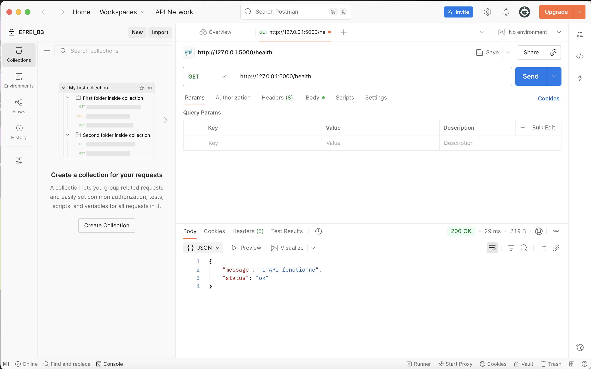

# ToDoList

Une  application en ligne de commande (CLI) pour gérer ta liste de tâches directement depuis le terminal, en suivant l’architecture MVC (Model–View–Controller).
Aucune dépendance externe — tout repose sur la bibliothèque standard de Python.

---

##  Fonctionnalités

* Ajouter une nouvelle tâche
* Afficher la liste des tâches
* Marquer une tâche comme terminée
* Supprimer une tâche
* Sauvegarde automatique dans un fichier JSON

---
## Installation

1. **Télécharger** ou **cloner** le projet :

```bash
git clone https://github.com/ton-utilisateur/Exercice1_Hamza_NADIFI.git
cd Exercice1_Hamza_NADIFI
```
2. S'ssurer d’avoir **Python 3.8+** installé.
3. Créer un **environnement virtuel** pour isoler le projet :

```bash
python3 -m venv env
source env/bin/activate  # (Windows : env\Scripts\activate)
```
4. Installe toutes les dépendances du projet (y compris Flask) :
```bash
pip install -r requirements.txt

```
5. Lance le serveur Flask :

```bash
python3 main.py
```

---


## Utilisation

1. Vérifie que l’API répond :
```bash
curl http://127.0.0.1:5000/health
```
- Retour:
```json
{"status": "ok"}
```
2. Liste les tâches :
```bash
curl http://127.0.0.1:5000/api/tasks
```
3. Ajoute une tâche :
```bash
curl -X POST http://127.0.0.1:5000/api/tasks \
     -H "Content-Type: application/json" \
     -d '{"title":"Apprendre Flask"}'
```

4. Modifie une tâche :
```bash
curl -X PATCH http://127.0.0.1:5000/api/tasks/1 \
     -H "Content-Type: application/json" \
```

5. Supprime une tâche :
```bash
curl -X DELETE http://127.0.0.1:5000/api/tasks/1
```

---


## Structure du projet

```
EXERCICE1_HAMZA_NADIFI/
├── main.py                     # Point d'entrée (Controller principal)
├── models/
│   └── task.py                 # Model : définit la classe Task
├── views/
│   └── cli_view.py             # View : gère l’affichage et les interactions utilisateur
├── controllers/
│   └── todo_controller.py      # Controller : relie la logique (model + view)
└── README.md
```

---

## Architecture MVC

Le projet respecte le modèle **MVC (Model–View–Controller)** :

| Couche         | Rôle                                  | Exemple                                           |
| -------------- | ------------------------------------- | ------------------------------------------------- |
| **Model**      | Gère les données et la logique métier | `Task`, gestion des attributs et de la sauvegarde |
| **View**       | Affiche les données à l’utilisateur   | `CLIView`, responsable des `print()`              |
| **Controller** | Fait le lien entre Model et View      | `ToDoController`, gère les commandes utilisateur  |

Cette séparation rend le code plus clair, maintenable et facile à faire évoluer.

---

## Rendu des manipulations de l'API via Postman:

#### Vérification de l’état de l’API




#### Liste toutes les tâches


#### Crée une nouvelle tâche


#### Récupère une tâche par ID


#### Met à jour une tâche (titre )


#### Supprime une tâche par ID

